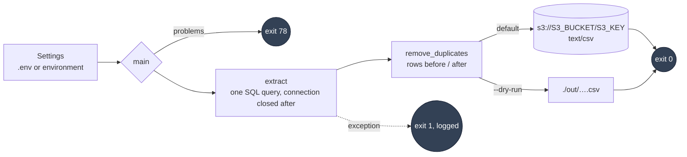

# ETL pipeline: Redshift → dedupe → S3

[](https://github.com/daniellopez882/etl-pipeline/actions/workflows/ci.yml)


A one-shot job. It runs one cleaning query against an online-transactions
table in Redshift, drops exact duplicate rows, and writes the result to S3 as
CSV — or, with `--dry-run`, to a local file. It exits 0 on success, 1 on
failure, and 78 when it is not configured.

## At a glance

| | |
|---|---|
| **Does** | Extract (cleaning in SQL: unknown descriptions filled, non-product stock codes removed, order value computed) → drop exact duplicates → upload CSV |
| **Configured by** | `REDSHIFT_*`, `S3_BUCKET`, `S3_KEY`; the old lowercase names still work |
| **Credentials** | Explicit `AWS_*` if set; otherwise boto3's default chain (instance role, profile, environment) |
| **Tests** | 23 — no Redshift, no S3; the extractor and the S3 client are injected |
| **CI** | lint · tests on 3.11/3.12 · `import main` must run nothing and an unconfigured run must exit 78 · bandit (fails the job) · gitleaks · container built, non-root, exit code checked |
| **Container** | multi-stage, uid 10001, `python main.py` as the entrypoint; the exit code is the result |

## Flow



## Quick start

```bash
python -m venv .venv && . .venv/bin/activate     # Windows: .venv\Scripts\activate
pip install -r requirements.txt
cp .env.example .env                              # Redshift connection, S3 bucket
python main.py --dry-run --limit 1000             # sample to ./out/, nothing uploaded
python main.py                                    # full run to S3
```

### Container

```bash
docker build -t etl-pipeline .
docker run --rm --env-file .env etl-pipeline                       # exit code = result
docker run --rm --env-file .env -v "$PWD/out:/app/out" etl-pipeline --dry-run
```

## Configuration

| Variable | Default | Notes |
|---|---|---|
| `REDSHIFT_DB` · `REDSHIFT_HOST` · `REDSHIFT_PORT` · `REDSHIFT_USER` · `REDSHIFT_PASSWORD` | — · — · `5439` · — · — | Required. `dbname`, `host`, `port`, `user`, `password` are accepted as aliases |
| `S3_BUCKET` · `S3_KEY` | — · `etl/online_transactions_cleaned.csv` | The bucket used to be hardcoded, with a personal name in the key |
| `AWS_ACCESS_KEY_ID` · `AWS_SECRET_ACCESS_KEY` · `AWS_DEFAULT_REGION` | — · — · `us-east-1` | Optional; `aws_secret_access_key_id` (sic) is accepted as an alias |
| `CONNECT_TIMEOUT_SECONDS` | `30` | |

## What changed, and why

| # | Defect | Effect |
|--:|---|---|
| 1 | The pipeline ran at module import — no `main()`, no `__main__` guard | `import main` connected to Redshift and uploaded to S3 (reproduced: an import with a fake `.env` attempted the connection). Nothing could be tested |
| 2 | The S3 bucket and key were hardcoded | A bootcamp bucket and a key with a person's name, for everyone who ran it |
| 3 | The AWS secret's variable was named `aws_secret_access_key_id` | Neither the AWS name nor what it holds; unset, boto3 silently used whatever credentials the machine had |
| 4 | The Redshift connection was never closed | One leaked connection per run |
| 5 | Everything printed; nothing returned a result or an exit code | A scheduler could not tell success from failure except by grepping stdout |
| 6 | `python:3.8` image (end of life), running as root, `COPY .` of the whole tree | |
| 7 | No tests, no CI | |
| 8 | The last commit "changed the licence to Apache 2.0" and added no licence file | The canonical Apache-2.0 text is now in `LICENSE` |

## Design notes

| Record | Decision |
|---|---|
| [ADR 0001](docs/adr/0001-a-job-is-a-function-with-an-exit-code.md) | A job is a function with an exit code, not a script that runs on import |
| [ADR 0002](docs/adr/0002-destinations-and-credentials-are-configuration.md) | Destinations and credentials are configuration; the default credential chain is the default |
| [Threat model](docs/threat-model.md) | Assets, four threats, what is not addressed |

## Layout

```
main.py            run() and main(); --dry-run, --limit, --output
src/config.py      settings with legacy aliases
src/extract.py     the query; a closed connection
src/transform.py   remove_duplicates → frame + counts
src/load.py        upload_frame (client injected) / write_local
tests/             23 tests
docs/              ADRs, threat model
```

## Limits

- One query, one table pair, one destination. The SQL names the `bootcamp`
  schema it was written against.
- The whole result is held in memory as a DataFrame and a CSV string; fine
  for the sizes this ran at, not for large tables.
- No retries; a transient Redshift or S3 failure is an exit 1 to be re-run by
  whatever schedules the job.
- Nothing here has been run against Redshift or S3 in this repository.

## Licence

Apache License 2.0 — see [LICENSE](LICENSE).
